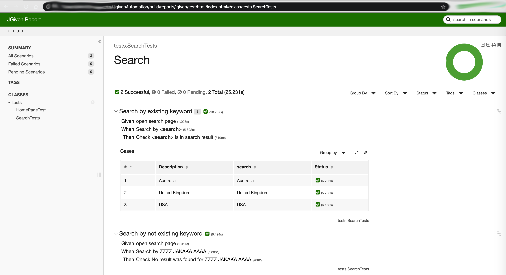

# SuperJavaBdd

This is an example of test automation framework using JGiven library to create BDD tests without additional DSL as in Cucumber or SpecFlow frameworks. 

Before runnung test you will have clone and build project.
Browser could be configured in gradle.properties file  src/test/resources/gradle.properties
Path for webdriver.gecko.driver, webdriver.chrome.driver and etc should be configured by user.

To run tests just run command in terminal: 
<b> gradle test jgivenTestReport </b>

for exaple to run test agains chromediver you need to set up browser in gradle.properties

<b> gradle test jgivenTestReport -Dwebdriver.chrome.driver=/path/to/driver </b>

After run all tests you could find a nice run report 
build/reports/jgiven/test/html/index.html

